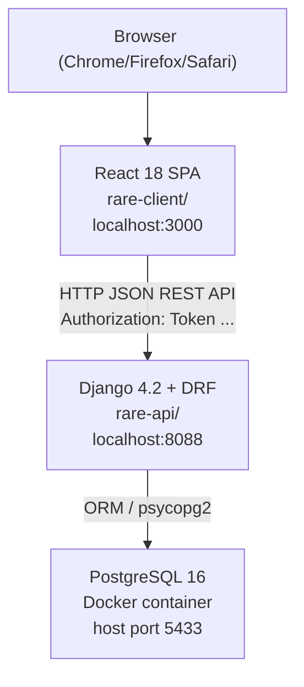
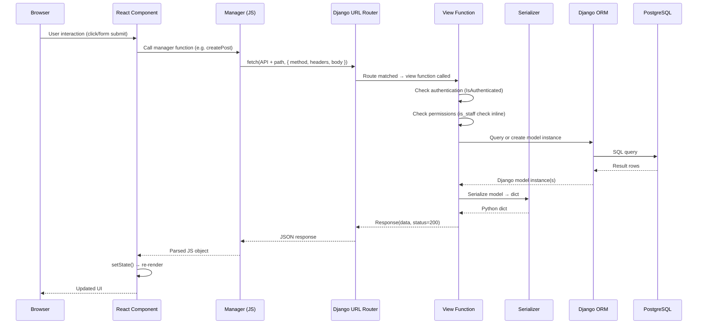
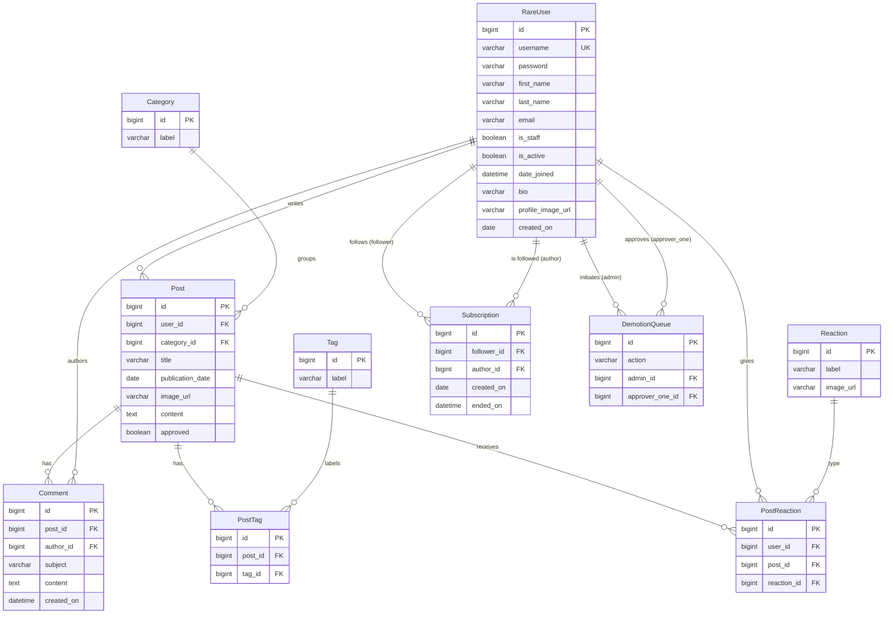
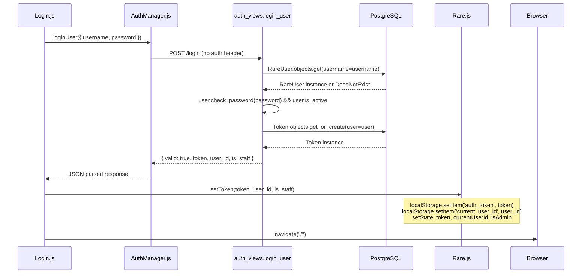
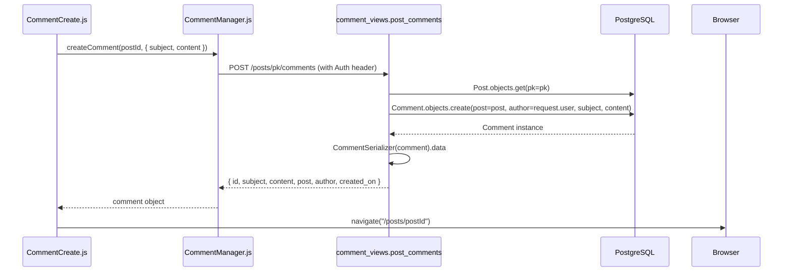
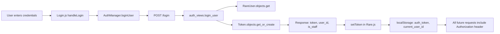

# Rare — Comprehensive Engineering Report

---

## 1. Executive Summary

Rare is a multi-user blogging platform built as an educational project at Nashville Software School (NSS). Its purpose is to teach intermediate software engineering students how a real-world full-stack web application is structured, how its layers communicate, and how professional engineering habits (reading before changing, testing before shipping, documenting decisions) are applied in practice.

The application allows users to write and publish posts, comment on posts, react to posts with emoji reactions, subscribe to authors, and browse content by category or tag. It has a two-tier user model — Authors and Admins — with a moderation workflow: Authors' posts must be approved by an Admin before they appear publicly. Admins can also manage tags, categories, reactions, and user accounts, including a sophisticated two-vote workflow for demoting or deactivating other admins.

**Architecture:** A separated monorepo with two independent sub-projects: `rare-api/` (Django 4.2 + Django REST Framework, PostgreSQL 16) and `rare-client/` (React 18, Bulma CSS). They communicate exclusively via a JSON REST API. The frontend is a single-page application served by Create React App's dev server; the backend runs as a Django development server. There is no shared code between the two sub-projects.

**Maturity:** The project is in active development and documented study. 18 tests pass against the backend. Core workflows (auth, posts, comments, subscriptions, reactions, admin moderation, user management) are fully implemented end-to-end. The project has a known-good baseline from Phase 0/1/2 stabilization work. Remaining work (Phase 3–5) focuses on end-to-end validation, test coverage expansion, and removing the hardcoded API URL.

---

## 2. Project Overview

**Business domain:** Online publishing / blogging platform.

**Functional goals:**
- Allow any registered user (Author) to write and submit posts for publication
- Allow Admins to moderate content by approving or rejecting posts
- Support content organization via categories (admin-managed) and tags (admin-managed)
- Allow readers to comment on posts, react to them with emoji, and subscribe to authors whose posts they want to follow
- Provide admins with user management tools, including account deactivation/reactivation and role promotion/demotion protected by a two-admin safety mechanism

**Major user workflows:**
1. Register → receive token → browse approved posts
2. Write a post → submit for admin approval → post becomes visible publicly
3. Search posts by title, filter by category or tag
4. View a post → read comments → add a comment → react with emoji
5. Visit an author's profile → subscribe → see their posts on the home feed
6. Admin: review unapproved posts → approve them
7. Admin: manage tags and categories (create/edit/delete)
8. Admin: manage user accounts (deactivate, reactivate, change role)
9. Admin: vote to deactivate or demote another admin (requires a second admin to approve)

**Problems solved:**
- Publishing workflow with moderation (posts don't go live without admin approval, unless written by an admin)
- Safe admin governance (no single admin can unilaterally remove another admin)
- Author subscription model (personalized home feed)
- Content discoverability (categories, tags, search)

---

## 3. High-Level Architecture

### Component Diagram



### System Context Diagram

```mermaid
C4Context
    Person(author, "Author", "Writes posts, comments, reacts, subscribes")
    Person(admin, "Admin", "Moderates posts, manages users/tags/categories/reactions")
    System(rare, "Rare Platform", "Full-stack blogging platform")
    System_Ext(docker, "Docker", "Runs PostgreSQL 16 container")
    System_Ext(fs, "Local Filesystem", "Stores uploaded images in media/")

    author --> rare
    admin --> rare
    rare --> docker
    rare --> fs
```

### Request Flow Diagram



---

## 4. Repository Organization

```
rare-project/                          ← monorepo root (not a git repo itself)
├── .gitignore
├── rare-api/                          ← Django backend (own git repo)
│   ├── .venv/                         ← Python virtual environment
│   ├── docker-compose.yml             ← PostgreSQL 16 service
│   ├── Pipfile                        ← Python dependencies
│   ├── pytest.ini                     ← pytest configuration
│   ├── CLAUDE.md                      ← project context for AI assistance
│   ├── manage.py                      ← Django management entry point
│   ├── rareproject/                   ← Django project package
│   │   ├── settings.py                ← All Django config (DB, auth, CORS, etc.)
│   │   ├── urls.py                    ← Root URL conf (delegates to rareapi.urls)
│   │   └── wsgi.py
│   └── rareapi/                       ← Django application package
│       ├── models/                    ← One file per model
│       │   ├── __init__.py            ← Re-exports all models
│       │   ├── rare_user.py
│       │   ├── post.py
│       │   ├── category.py
│       │   ├── comment.py
│       │   ├── tag.py
│       │   ├── post_tag.py
│       │   ├── reaction.py
│       │   ├── post_reaction.py
│       │   ├── subscription.py
│       │   └── demotion_queue.py
│       ├── views/                     ← One file per resource group
│       │   ├── __init__.py            ← Re-exports all view functions
│       │   ├── auth_views.py
│       │   ├── post_views.py
│       │   ├── category_views.py
│       │   ├── comment_views.py
│       │   ├── tag_views.py
│       │   ├── user_views.py
│       │   ├── subscription_views.py
│       │   └── reaction_views.py
│       ├── serializers/               ← One file per resource group
│       │   ├── __init__.py
│       │   ├── user_serializers.py
│       │   ├── post_serializers.py
│       │   ├── category_serializers.py
│       │   ├── comment_serializers.py
│       │   ├── tag_serializers.py
│       │   ├── reaction_serializers.py
│       │   └── demotion_queue_serializers.py
│       ├── services/
│       │   ├── __init__.py
│       │   └── admin_actions.py       ← Two-admin vote business logic
│       ├── tests/
│       │   ├── __init__.py
│       │   ├── test_auth.py           ← Login, register, /me tests
│       │   └── test_admin_actions.py  ← Service-layer tests
│       ├── migrations/                ← 5 migrations (0001–0005)
│       ├── fixtures/
│       │   └── initial_data.json      ← Seed data (314 objects)
│       └── urls.py                    ← All API URL patterns
└── rare-client/                       ← React frontend
    ├── package.json
    └── src/
        ├── Rare.js                    ← Root component (token, userId, isAdmin state)
        ├── views/
        │   ├── ApplicationViews.js    ← All routes
        │   ├── Authorized.js          ← Auth guard (redirects to /login)
        │   └── AdminOnly.js           ← Admin guard (redirects to /)
        ├── managers/                  ← One file per resource group
        │   ├── api.js                 ← API base URL + authHeader()
        │   ├── AuthManager.js
        │   ├── PostManager.js
        │   ├── CategoryManager.js
        │   ├── CommentManager.js
        │   ├── TagManager.js
        │   ├── UserManager.js
        │   ├── SubscriptionManager.js
        │   └── ReactionManager.js
        ├── components/                ← Organized by feature domain
        │   ├── auth/
        │   │   ├── Login.js
        │   │   ├── Login.test.js
        │   │   └── Register.js
        │   ├── nav/
        │   │   ├── NavBar.js
        │   │   ├── NavBar.css
        │   │   └── rare.jpeg
        │   ├── home/
        │   │   └── Home.js
        │   ├── posts/
        │   │   ├── PostList.js
        │   │   ├── PostDetail.js
        │   │   ├── PostCreate.js
        │   │   ├── PostEdit.js
        │   │   ├── MyPostList.js
        │   │   ├── PostSearch.js
        │   │   ├── PostsByCategory.js
        │   │   ├── PostsByTag.js
        │   │   ├── ManagePostTags.js
        │   │   ├── UnapprovedPostList.js
        │   │   └── ApprovedPostList.js
        │   ├── comments/
        │   │   ├── CommentCreate.js
        │   │   └── CommentEdit.js
        │   ├── categories/
        │   │   ├── CategoryList.js
        │   │   ├── CategoryCreate.js
        │   │   └── CategoryEdit.js
        │   ├── tags/
        │   │   ├── TagList.js
        │   │   ├── TagCreate.js
        │   │   └── TagEdit.js
        │   ├── users/
        │   │   ├── UserProfileDetail.js
        │   │   ├── UserProfileList.js
        │   │   ├── UserPostList.js
        │   │   ├── UserTypeForm.js
        │   │   └── DemotionQueueList.js
        │   └── reactions/
        │       └── ReactionCreate.js
        └── utils/
            └── dates.js               ← Date formatting helper
```

**Naming conventions:**
- Backend Python files: `snake_case` (matches Django convention)
- Frontend JS files: `PascalCase` for components and managers
- Backend model files: singular noun (`post.py`, `comment.py`)
- Frontend component files: descriptive noun + action verb (`PostCreate.js`, `CommentEdit.js`)
- Manager files mirror resource names: `PostManager.js` pairs with `post_views.py`

**Separation of concerns:**
- URL routing is entirely in `rareapi/urls.py` (one place to see all endpoints)
- Business logic too complex for a view lives in `services/`
- Serializers handle all model ↔ JSON translation
- Frontend managers are the only place fetch calls live — components never call `fetch()` directly

---

## 5. Technology Stack

| Layer | Technology | Version | Responsibility | Where it appears |
|---|---|---|---|---|
| Backend language | Python | 3.13 | All backend code | `rare-api/` |
| Web framework | Django | 4.2.30 | URL routing, ORM, migrations, admin, settings | `rareproject/`, `rareapi/models/`, `rareapi/migrations/` |
| REST API layer | Django REST Framework | 3.17.1 | Serializers, `@api_view` decorators, `Response`, `IsAuthenticated`, token auth | `rareapi/views/`, `rareapi/serializers/` |
| Authentication | DRF Token Authentication | (DRF built-in) | Opaque tokens stored per user, validated on each request | `settings.py` line 147, `auth_views.py`, `Token.objects.get_or_create` |
| Database | PostgreSQL | 16 | Persistent data storage | `docker-compose.yml`, `settings.py` lines 82–91 |
| DB driver | psycopg2-binary | ~2.9 | Python ↔ PostgreSQL wire protocol | `Pipfile` |
| Containerization | Docker / Docker Compose | (any modern) | Runs PostgreSQL in isolation; host port 5433 → container port 5432 | `docker-compose.yml` |
| CORS | django-cors-headers | ~4.3 | Allows browser requests from localhost:3000 | `settings.py` lines 43, 140–142, `MIDDLEWARE` |
| Testing | pytest + pytest-django | any | Test discovery, Django database fixtures | `pytest.ini`, `rareapi/tests/` |
| Frontend language | JavaScript (ES2020+) | — | All frontend code | `rare-client/src/` |
| UI framework | React | 18.2 | Component-based declarative UI | `rare-client/src/` |
| Routing | React Router DOM | v6.3 | Client-side navigation, nested routes, `<Outlet>` guards | `ApplicationViews.js`, `Authorized.js`, `AdminOnly.js` |
| CSS framework | Bulma | 0.9.4 | Utility CSS classes (no custom CSS except `NavBar.css`) | `package.json`, all component JSX |
| Build tool | Create React App / react-scripts | 5.0.1 | Webpack dev server, hot reload, build pipeline | `package.json` |
| Image storage | Django filesystem / `MEDIA_ROOT` | — | Post and profile images stored under `media/` directory | `settings.py` lines 130–131, `post_views.py` lines 253–265 |

---

## 6. Domain Model

### Entity-Relationship Diagram



### Model Detail

**RareUser** (`rareapi/models/rare_user.py`)
Extends Django's `AbstractUser`. Custom additions: `bio` (CharField, max 500, optional), `profile_image_url` (CharField, max 500, optional), `created_on` (DateField, auto-populated). `is_staff` is the sole distinction between Author and Admin. `is_active` controls login access. Declared as `AUTH_USER_MODEL` in `settings.py`.

**Post** (`rareapi/models/post.py`)
The central content object. FKs to `RareUser` and `Category`. `approved` (boolean, default False) is the moderation gate — only approved posts with `publication_date <= today` appear in the public list.

**Category** (`rareapi/models/category.py`)
Simple lookup table. Only `label` field. Admin-only create/update/delete. Posts belong to exactly one category.

**Tag** (`rareapi/models/tag.py`)
Simple lookup table. Only `label` field. Admin-only create/update/delete. Posts can have zero or more tags via the `PostTag` join table. Tag updates are atomic — all existing PostTags deleted and recreated.

**PostTag** (`rareapi/models/post_tag.py`)
Join table: `post` FK + `tag` FK. No extra fields.

**Comment** (`rareapi/models/comment.py`)
Belongs to a `Post` and an `author` (FK to RareUser). Fields: `subject`, `content`, `created_on`. Comment authors and admins can edit/delete.

**Reaction** (`rareapi/models/reaction.py`)
Lookup table for reaction types. `label` + `image_url` (stores emoji character in practice). Admin-only creation.

**PostReaction** (`rareapi/models/post_reaction.py`)
Three-way join: `user`, `post`, `reaction`. No unique constraint at the database level.

**Subscription** (`rareapi/models/subscription.py`)
Soft-delete pattern. `follower` FK + `author` FK. `ended_on` (DateTimeField, nullable) — null means active, non-null means unsubscribed.

**DemotionQueue** (`rareapi/models/demotion_queue.py`)
Holds pending two-admin votes. `action` stored as string: `"deactivate:<user_pk>"` or `"demote:<user_pk>"`. `unique_together` on `(action, admin, approver_one)` prevents duplicate votes at the database level.

### Domain Glossary

| Term | Definition |
|---|---|
| Author | Regular registered user (`is_staff=False`). Can write posts, comment, react, subscribe. |
| Admin | Privileged user (`is_staff=True`). Has all Author capabilities plus moderation and management powers. |
| Post | A piece of written content submitted by a user. Has a moderation lifecycle. |
| Approved | Boolean on Post. True = publicly visible (if `publication_date <= today`). |
| Publication date | The date a post is intended to go live. Currently always set to today on creation. |
| Category | Broad content grouping applied to posts (one per post). Admin-managed. |
| Tag | Label applied to posts (many per post). Admin-managed. |
| Reaction | Emoji a user can apply to a post (toggled on/off). Admin-created. |
| Subscription | A directed "follow" relationship from follower to author. Soft-deleted (`ended_on`). |
| DemotionQueue | A pending vote to deactivate or demote an admin, waiting for a second admin's approval. |
| Token | Opaque authentication credential issued at login, stored in localStorage, sent as `Authorization: Token <key>`. |

---

## 7. Request Flow Analysis

### 7.1 Login



Files touched: `Login.js`, `AuthManager.js`, `api.js`, `rareapi/urls.py`, `auth_views.py`, `RareUser` model, `Token` model.

### 7.2 Creating a Post

```mermaid
sequenceDiagram
    participant PC as PostCreate.js
    participant PM as PostManager.js
    participant V as post_views.post_list
    participant DB as PostgreSQL

    PC->>PM: createPost({ title, category_id, content })
    PM->>V: POST /posts (with Auth header)
    V->>V: IsAuthenticated check
    V->>DB: Category.objects.get(pk=category_id)
    V->>DB: Post.objects.create(user=req.user, approved=req.user.is_staff, ...)
    DB-->>V: Post instance
    V->>V: PostDetailSerializer(post).data
    V-->>PM: { id, title, content, ..., approved: false/true }
    PM-->>PC: post object
    opt file selected
        PC->>PM: uploadPostImage(post.id, formData)
        PM->>V: PUT /posts/id/image (multipart)
        V->>V: Write file to media/post_images/
        V->>DB: post.image_url = absolute_url; post.save()
        V-->>PM: { image_url }
    end
    PC->>Browser: navigate("/posts/post.id")
```

Key business rule: `approved=request.user.is_staff` (`post_views.py` line 33). Admin posts auto-approve; Author posts enter the moderation queue.

### 7.3 Approving a Post

```mermaid
sequenceDiagram
    participant UPL as UnapprovedPostList.js
    participant PM as PostManager.js
    participant V as post_views.approve_post
    participant DB as PostgreSQL

    UPL->>PM: approvePost(postId)
    PM->>V: PUT /posts/pk/approve (with Auth header)
    V->>V: IsAuthenticated check
    V->>V: if not request.user.is_staff: return 403
    V->>DB: Post.objects.get(pk=pk)
    V->>DB: post.approved = True; post.save()
    V->>V: PostDetailSerializer(post).data
    V-->>PM: updated post object
    PM-->>UPL: response
    UPL->>UPL: loadPosts() → re-fetches unapproved list
```

### 7.4 Creating a Comment



### 7.5 Subscribing to an Author

```mermaid
sequenceDiagram
    participant UPD as UserProfileDetail.js
    participant SM as SubscriptionManager.js
    participant V as subscription_views.subscribe
    participant DB as PostgreSQL

    UPD->>SM: subscribeToUser(authorId)
    SM->>V: POST /profiles/author_id/subscribe (with Auth header)
    V->>DB: RareUser.objects.get(pk=author_id)
    V->>DB: Subscription.objects.get_or_create(follower=request.user, author=author)
    alt not created AND ended_on is not None
        V->>DB: subscription.ended_on = None; subscription.save()
        V-->>SM: { message: 'Resubscribed successfully' } 200
    else created
        V-->>SM: { message: 'Subscribed successfully' } 201
    else already subscribed and active
        V-->>SM: { message: 'Already subscribed' } 200
    end
    SM-->>UPD: response
    UPD->>UPD: setProfile({ ...profile, is_subscribed: true })
```

---

## 8. Frontend Architecture

### Component Organization
Components are in `src/components/` organized by feature domain: `auth/`, `nav/`, `home/`, `posts/`, `comments/`, `categories/`, `tags/`, `users/`, `reactions/`.

### Routing
All routes are declared in `ApplicationViews.js`. React Router v6 with nested routes and `<Outlet>` implements guards:
- **`Authorized`**: Checks if `token` is truthy. If not → redirects to `/login`. If yes → renders `<Outlet />`.
- **`AdminOnly`**: Nested inside Authorized. Checks if `isAdmin` is true. If not → redirects to `/`.
- Unauthenticated routes (`/login`, `/register`) are outside the `Authorized` wrapper.

### State Management
No Redux, Context API, or global state library. State at three levels:
1. **Global auth state** (`Rare.js`): `token`, `currentUserId`, `isAdmin` — component state seeded from `localStorage`, re-verified via `/me` on page refresh.
2. **Component-local state**: Each component manages its own data via `useState` + `useEffect` calls through managers.
3. **URL state**: Route params (`useParams`) and search params (`useSearchParams`).

### API Communication
All fetch calls go through manager functions in `src/managers/`. Components never call `fetch()` directly. `api.js` exports two helpers: `API` (hardcoded `"http://localhost:8088"`) and `authHeader()` (reads from `localStorage`).

### Authentication in the Frontend
1. On login/register: `{ token, user_id, is_staff }` → stored in localStorage + React state.
2. On page refresh: `Rare.js` detects existing token → calls `getMe()` → updates `isAdmin` from server.
3. On logout: `setToken(null)` clears localStorage and all state.
4. Invalid token: `getMe()` fails → `setToken(null)` called in catch block.

### Styling
Bulma 0.9.4 is the sole CSS framework. The only custom CSS file is `NavBar.css`. No CSS Modules, styled-components, or Tailwind.

### Data Flow
Components fetch on mount (`useEffect(() => { ... }, [])`), store in state, and render. Mutations trigger a re-fetch via a `loadData()` function defined inside the component. No client-side cache, no optimistic updates, no global store.

---

## 9. Backend Architecture

### URL Routing
Root URL conf (`rareproject/urls.py`): delegates all routes to `rareapi/urls.py`. That file has 27 `path()` entries. `APPEND_SLASH = False` means URLs do not auto-redirect if missing a trailing slash.

### Views
All views are function-based, decorated with `@api_view` and `@permission_classes`. No class-based views. HTTP method dispatch is if/elif inside the view function. `IsAuthenticated` handles token validation. Login and register bypass all auth via `@authentication_classes([])` and `@permission_classes([])`.

### Serializers
Two depth patterns:
- **List serializers** (`PostListSerializer`): Minimal fields for list views.
- **Detail serializers** (`PostDetailSerializer`): Full fields including nested tags via `SerializerMethodField`.

`ProfileDetailSerializer` uses `context={'request': request}` to compute `is_subscribed` for the current viewer. `DemotionQueueSerializer` parses the `action` string via `_parse_action`.

### Services
`admin_actions.py` is the only service module. It encapsulates the two-admin vote logic using a `dataclass ActionResult` with three possible outcomes: `executed`, `queued`, or `error`. The logic is testable without HTTP.

### Authentication Mechanism
DRF `TokenAuthentication` only. Tokens are DRF's built-in `Token` model (one token per user). Created on login (`get_or_create`) and on registration. No token expiry, no refresh mechanism, no JWT.

---

## 10. Data Flow

### Authentication Data Flow



### Post Creation Data Flow

```
PostCreate.js
  └── managers/PostManager.createPost
        └── POST /posts
              └── post_views.post_list
                    ├── Category.objects.get(pk=category_id)
                    ├── Post.objects.create(
                    │     user=request.user,
                    │     category=category,
                    │     approved=request.user.is_staff  ← key rule
                    │   )
                    └── PostDetailSerializer(post).data → Response 201
```

### Admin Deactivation Data Flow

```
UserProfileList.js handleDeactivate
  └── managers/UserManager.deactivateUser
        └── PUT /profiles/<pk>/deactivate
              └── user_views.deactivate_user
                    └── services/admin_actions.deactivate_user(actor, target)
                          ├── target is_staff=False → immediate: is_active=False; save()
                          └── target is_staff=True →
                                ├── duplicate vote check → error
                                ├── second vote → execute + delete queue item
                                └── first vote → DemotionQueue.objects.create(...)
```

---

## 11. Business Rules

### Rule 1: Post Approval Workflow
**Location:** `post_views.py` line 33 — `approved=request.user.is_staff`
**Rule:** Posts created by regular Authors start `approved=False` and don't appear publicly until an admin approves them. Admin-created posts auto-approve.
**Public post filter:** `filter(approved=True, publication_date__lte=timezone.now().date())`

### Rule 2: Two-Admin Vote for Admin Actions
**Location:** `services/admin_actions.py`
**Rule:** Deactivating or demoting an admin requires two separate admins to vote. First vote queues the action; second vote executes it.
- Same admin cannot vote twice (line 51 duplicate check)
- Cannot remove the last remaining active admin (last-admin guard line 56)
- Regular users can be deactivated/role-changed immediately by any single admin

### Rule 3: Ownership Checks on Post Edit/Delete
**Location:** `post_views.py` lines 55–63
- Edit: owner only (`post.user != request.user` → 403)
- Delete: owner OR any admin

### Rule 4: Comment Ownership Checks
**Location:** `comment_views.py` lines 41, 49
- Edit: author only
- Delete: author OR any admin

### Rule 5: Admin-Only Category/Tag/Reaction Management
**Location:** `category_views.py`, `tag_views.py`, `reaction_views.py`
Creating, editing, or deleting these requires `is_staff=True`.

### Rule 6: Admin-Only User List and Deactivation
**Location:** `user_views.py` lines 26–27, 36–37, 51–52, 68–69
Viewing the full user list, deactivating users, and changing user types requires `is_staff=True`.

### Rule 7: Profile Image Upload Restriction
**Location:** `user_views.py` lines 104–105
Profile image uploads are restricted to the user's own profile (`request.user.id != pk` → 403).

### Rule 8: Post Tag Management Restricted to Post Owner
**Location:** `post_views.py` lines 278–280
Only the post's author can update its tags. Updates are atomic: all existing PostTags deleted and recreated.

### Rule 9: Subscription Soft Delete
**Location:** `subscription_views.py` lines 21–23
Unsubscribing sets `ended_on` to `now()`. Resubscribing resets it to null. History is preserved.

### Rule 10: Publication Date Gate
**Location:** `post_views.py` line 40
Approved posts with a future `publication_date` are not shown publicly. Enables scheduled posts (no UI exposes future-date setting currently).

### Rule 11: Cancel Demotion Vote Restricted to Initiator
**Location:** `user_views.py` lines 145–147
Only the admin who cast the first vote can cancel it (`item.admin != request.user` → 403).

---

## 12. Engineering Conventions

### View Style
All backend views: function-based with `@api_view`. No class-based views. Intentional educational choice — function-based views are more transparent.

### API Design
- Resources follow RESTful conventions: `GET /posts` (list), `POST /posts` (create), `GET /posts/<pk>` (retrieve), `PUT /posts/<pk>` (update), `DELETE /posts/<pk>` (delete)
- Non-CRUD actions get their own URL segments: `/posts/<pk>/approve`, `/posts/<pk>/tags`, `/profiles/<pk>/subscribe`
- `/posts/search` comes before `/posts/<int:pk>` in `urls.py` to prevent "search" being treated as an integer ID
- Response bodies: `{ 'error': '...' }` for errors, serialized model data for success. No envelope wrapping.

### Error Handling
- Backend: explicit `try/except ModelDoesNotExist` → 404. Admin checks → 403. Validation via `serializer.is_valid(raise_exception=True)`.
- Frontend: minimal. Most managers `.then(res => res.json())` without checking `res.ok`.

### Testing Conventions
- pytest with `pytest-django` (not Django's `TestCase`)
- Tests organized in classes with `test_` prefixed methods
- Service-layer tests test logic directly without HTTP
- HTTP-layer tests use `APIClient` from DRF

### JavaScript Conventions
- Named exports (no default exports). Components are arrow functions assigned to `const`.
- `useRef` for simple form inputs. `useState` for data triggering re-renders.
- `useEffect` with empty dependency array `[]` for on-mount fetches.
- Promise chaining (`.then()`), not async/await.

---

## 13. Configuration

### Environment Variables
**There are none.** Everything is hardcoded:
- Database credentials: `settings.py` lines 83–90
- Django secret key: `settings.py` line 24 (insecure, development only)
- `DEBUG = True`: `settings.py` line 27
- API base URL: `src/managers/api.js` line 1

### Django Settings Key Values

| Setting | Value | Purpose |
|---|---|---|
| `AUTH_USER_MODEL` | `'rareapi.RareUser'` | Custom user model |
| `DATABASES` | PostgreSQL on localhost:5433 | DB connection |
| `CORS_ORIGIN_WHITELIST` | `['http://localhost:3000']` | Allow React dev server |
| `APPEND_SLASH` | `False` | No auto-slash redirect |
| `REST_FRAMEWORK` | `TokenAuthentication` only | Token auth |
| `MEDIA_URL` | `'/media/'` | URL prefix for uploads |
| `MEDIA_ROOT` | `os.path.join(BASE_DIR, 'media')` | Filesystem path |

### Startup Process
1. `cd rare-api && docker compose up -d db`
2. `.venv/bin/python manage.py migrate`
3. `.venv/bin/python manage.py loaddata rareapi/fixtures/initial_data.json` (first time only)
4. `.venv/bin/python manage.py runserver 8088`
5. `cd rare-client && npm start`

---

## 14. Security Analysis

### What Is Implemented
- **Authentication:** DRF `TokenAuthentication`. Invalid tokens → 401. Inactive users cannot log in (explicit `user.is_active` check in `login_user`).
- **Authorization:** `@permission_classes([IsAuthenticated])` on every protected endpoint. Inline `is_staff` checks for admin-only operations.
- **CORS:** Only `http://localhost:3000` whitelisted.
- **Password handling:** PBKDF2-SHA256 via Django's default hashing pipeline. `create_user()` used in `RegisterSerializer.create()`.
- **CSRF:** Present in middleware but not relevant for token-auth API endpoints (DRF token auth is exempt by design).

### What Is Not Implemented
- No token expiry or rotation
- No rate limiting
- `SECRET_KEY` hardcoded (development only)
- `DEBUG = True` would expose stack traces in production
- `PostReaction` has no unique constraint — duplicate reactions possible
- Token stored in `localStorage` — exposed to XSS (tradeoff accepted for educational simplicity)
- No HTTPS configuration

---

## 15. Testing

### Current State
18 tests, 18 passing. Located in `rare-api/rareapi/tests/`.

### Test Files

**`test_auth.py`** — HTTP-layer tests via DRF `APIClient`:
- `TestLogin`: valid credentials → token; bad password → `{valid: False}`; inactive user → `{valid: False}`; admin → `is_staff: True`
- `TestRegister`: creates user, returns token, `is_staff: False`
- `TestMe`: authenticated → user data; unauthenticated → 401; invalid token → 401

**`test_admin_actions.py`** — Service-layer tests (no HTTP):
- `TestDeactivate`: author deactivated immediately; first admin vote queues; second admin vote executes; same admin cannot double-vote
- `TestChangeRole`: promoting author is immediate; demoting admin requires two votes; invalid role → error; same admin cannot double-vote on demotion

### What Is Not Tested
Post CRUD, post approval via HTTP, comments, categories, tags, reactions, subscriptions, image uploads, search, profile endpoints, DemotionQueue list/cancel, last-admin guard, frontend components.

---

## 16. Repository Navigation Guide

| Task | Go here |
|---|---|
| Add a new API endpoint | `rareapi/urls.py` (add path) + `rareapi/views/<resource>_views.py` (add function) |
| Add a new model | `rareapi/models/<name>.py` (create file) + `rareapi/models/__init__.py` (add import) + makemigrations + migrate |
| Add a serializer | `rareapi/serializers/<resource>_serializers.py` |
| Change authentication logic | `rareapi/views/auth_views.py` |
| Change who can access an endpoint | Inline `is_staff` check in the relevant view file |
| Change the two-admin vote logic | `rareapi/services/admin_actions.py` |
| Add a Django setting | `rareproject/settings.py` |
| Add a URL route | `rareapi/urls.py` |
| Add a React page | Create component in `src/components/<feature>/` + add `<Route>` in `ApplicationViews.js` |
| Add frontend API calls for a resource | Create/edit `src/managers/<Resource>Manager.js` |
| Change the API base URL | `src/managers/api.js` line 1 |
| Change the auth header format | `src/managers/api.js` — `authHeader()` function |
| Add a navbar link | `src/components/nav/NavBar.js` |
| Guard a route (auth required) | Nest inside `<Route element={<Authorized ...>}>` in `ApplicationViews.js` |
| Guard a route (admin only) | Nest inside `<Route element={<AdminOnly ...>}>` in `ApplicationViews.js` |
| Add a test | `rareapi/tests/test_<feature>.py` |
| Run tests | `cd rare-api && .venv/bin/python -m pytest rareapi/tests/ -v` |
| Change date formatting | `src/utils/dates.js` |

---

## 17. Feature Map

| Feature | Frontend Files | Backend Files | Models | Serializers |
|---|---|---|---|---|
| Login | Login.js, AuthManager.js | auth_views.login_user | RareUser, Token | — |
| Register | Register.js, AuthManager.js | auth_views.register_user | RareUser, Token | RegisterSerializer |
| Browse posts | PostList.js, PostManager | post_views.post_list (GET) | Post, Category, RareUser | PostListSerializer |
| View post detail | PostDetail.js, PostManager | post_views.post_detail (GET) | Post, Category, Tag, PostTag | PostDetailSerializer |
| Create post | PostCreate.js, PostManager | post_views.post_list (POST) | Post, Category | PostDetailSerializer |
| Edit post | PostEdit.js, PostManager | post_views.post_detail (PUT) | Post, Category | PostDetailSerializer |
| Delete post | PostDetail.js, PostManager | post_views.post_detail (DELETE) | Post | — |
| Upload post image | PostCreate.js, PostEdit.js, PostManager | post_views.upload_post_image | Post | — |
| Search posts | PostSearch.js, NavBar.js, PostManager | post_views.search_posts | Post | PostListSerializer |
| My posts | MyPostList.js, PostManager | post_views.my_post_list | Post | PostListSerializer |
| Subscribed posts (Home) | Home.js, PostManager | post_views.subscribed_posts | Post, Subscription | PostListSerializer |
| Posts by category | PostsByCategory.js, PostManager | post_views.category_post_list | Post, Category | PostListSerializer |
| Posts by tag | PostsByTag.js, PostManager | post_views.tag_post_list | Post, Tag, PostTag | PostListSerializer |
| Manage post tags | ManagePostTags.js, PostManager | post_views.post_tags | Post, Tag, PostTag | PostDetailSerializer |
| Approve/unapprove posts | UnapprovedPostList.js, PostManager | post_views.approve_post | Post | PostDetailSerializer |
| Comments | PostDetail.js, CommentCreate.js, CommentEdit.js, CommentManager | comment_views.* | Comment, Post, RareUser | CommentSerializer |
| Categories | CategoryList.js, CategoryCreate.js, CategoryEdit.js, CategoryManager | category_views.* | Category | CategorySerializer |
| Tags | TagList.js, TagCreate.js, TagEdit.js, TagManager | tag_views.* | Tag | TagSerializer |
| Reactions | PostDetail.js, ReactionCreate.js, ReactionManager | reaction_views.* | Reaction, PostReaction, Post | ReactionSerializer |
| User profiles | UserProfileDetail.js, UserProfileList.js, UserManager | user_views.profile_* | RareUser | ProfileDetailSerializer |
| Upload profile image | UserProfileDetail.js, UserManager | user_views.upload_profile_image | RareUser | — |
| Subscribe/Unsubscribe | UserProfileDetail.js, SubscriptionManager | subscription_views.* | Subscription, RareUser | — |
| Deactivate/Reactivate user | UserProfileList.js, UserManager | user_views.deactivate_user | RareUser, DemotionQueue | — |
| Change user role | UserTypeForm.js, UserManager | user_views.change_user_type | RareUser, DemotionQueue | — |
| Demotion queue | DemotionQueueList.js, UserManager | user_views.demotion_queue_list | DemotionQueue | DemotionQueueSerializer |

---

## 18. Architecture Decision Analysis

### Decision 1: Function-Based Views Instead of ViewSets
**Observed:** All views use `@api_view` function decorators.
**Inferred reasoning:** Educational. Function-based views expose every line of logic explicitly. A student can read a view top-to-bottom and understand exactly what it does. `ModelViewSet` hides logic behind method routing conventions that are harder to trace when learning.

### Decision 2: Services Directory for Business Logic
**Observed:** `admin_actions.py` in `services/` holds two-admin vote logic; simpler checks stay inline in views.
**Inferred reasoning:** The two-admin vote logic is the most complex business rule in the system. Placing it in `services/` allows it to be tested without HTTP, as demonstrated by `test_admin_actions.py`.

### Decision 3: Token Authentication Over Sessions
**Observed:** Only `TokenAuthentication` configured.
**Inferred reasoning:** Token auth is stateless and works naturally with a separated SPA+API architecture. Sessions require cookies and same-domain configuration. Token storage in `localStorage` is simpler to implement and understand in an educational context.

### Decision 4: One File Per Model / View / Serializer
**Observed:** Ten model files, eight view files, seven serializer files.
**Inferred reasoning:** Enforces single-responsibility. The `__init__.py` re-export pattern means consumers don't need to know the internal file structure.

### Decision 5: Soft Delete for Subscriptions
**Observed:** `Subscription.ended_on` set to `now()` on unsubscribe rather than deleting the row.
**Inferred reasoning:** Preserves subscription history. Allows resubscription without creating duplicate records. A common real-world pattern worth teaching.

### Decision 6: `action` as a Formatted String in DemotionQueue
**Observed:** `DemotionQueue.action` stores strings like `"deactivate:42"`.
**Inferred reasoning:** Avoids adding a `GenericForeignKey` or separate table per action type. Simple and readable at the cost of parsing logic in the serializer.

### Decision 7: `APPEND_SLASH = False`
**Observed:** `settings.py` line 144.
**Inferred reasoning:** The React frontend calls URLs without trailing slashes. Without this setting, Django would 301-redirect `POST /login` to `/login/`, stripping the request body and causing failures.

### Decision 8: Hardcoded API URL
**Observed:** `api.js` line 1, no `.env` file.
**Inferred reasoning:** Simplicity for the educational context. Documented as a known limitation for Phase 5.

### Decision 9: Docker Port 5433
**Observed:** `docker-compose.yml` maps `5433:5432`.
**Inferred reasoning:** EDB PostgreSQL 16 was already running on port 5432. This remapping avoids a port conflict without stopping the system database.

---

## 19. Technical Debt and Rough Edges

### Verified (observed directly in code)

1. **No environment variables.** `settings.py` has `SECRET_KEY`, database credentials, and `DEBUG=True` hardcoded. Production deployment would require significant changes.

2. **No token expiry.** DRF's built-in tokens never expire. A stolen token remains valid indefinitely.

3. **PostReaction has no unique constraint.** A user can react to the same post with the same reaction multiple times, potentially inflating reaction counts.

4. **Image upload does not replace previous file on disk.** Old image files accumulate in `media/post_images/` on each re-upload.

5. **`ProfileDetailSerializer` makes database queries inside `get_is_subscribed` and `get_subscriber_count`.** If used in a list endpoint, would cause N+1 queries. Currently safe because the profile list uses `ProfileListSerializer`.

6. **`DemotionQueue.approver_one` is redundant with `admin`.** Both fields point to the same user. The field name suggests it was intended to track the second approver, but it is never set to the second admin.

7. **No frontend error handling for network failures.** Most managers call `.then(res => res.json())` without checking `res.ok`. A 500 response would throw an unhandled promise rejection.

8. **`publication_date` cannot be set by the user.** Always set to `today()` on create. The model supports future dates but no UI path exposes this.

### Reasonable Inferences

9. **Missing test coverage** for post CRUD, comments, subscriptions, reactions, image uploads, and search.

10. **No paginator.** The post list returns all approved posts. Will become slow as data grows.

11. **Category filter in PostList is client-side.** Fetches all posts and filters in the browser — does not scale.

---

## 20. Mental Models

### The Stack as a Relay Race
A user action travels through a relay of layers, each responsible for one thing, passing the baton to the next:
- **React component** — knows what the user wants to do
- **Manager function** — knows how to ask the server (which URL, method, headers)
- **HTTP request** — the actual network message
- **Django URL router** — knows which function handles this URL
- **View function** — knows the rules: who can do this, what should happen
- **Serializer** — knows how to translate between Python objects and JSON
- **ORM** — knows how to talk to the database
- **PostgreSQL** — stores and retrieves data

Each layer is ignorant of the others' internals. A component doesn't know SQL. A view doesn't know HTML.

### Authentication as a Wristband
You prove your identity once (login), receive a wristband (the token string). Every door (every API call) requires showing the wristband. Invalid wristband → 401. No wristband → `Authorized.js` redirects to `/login`.

### Migrations as a Recipe Card
The `migrations/` folder is a step-by-step recipe that rebuilds the database schema from scratch. Running `migrate` applies only the steps not yet applied.

### The Two-Admin Vote as a Safe with Two Keys
Changing an admin's status requires two keys. The first admin's vote deposits their key into `DemotionQueue`. The second admin's vote uses both keys to open the safe (executes the action) and removes the keys (deletes the queue row).

### The Approval Queue as a Holding Room
When an Author submits a post, it goes into a holding room (`approved=False`). The public cannot see it. An Admin walks through the holding room (`/unapprovedposts`) and decides which posts to admit to the main area. Admin-written posts skip the holding room entirely.

### `Authorized` and `AdminOnly` as Nested Checkpoints
- **Lobby** (`/login`, `/register`): open to everyone
- **Members-only floor** (`/posts`, etc.): requires keycard (`token`). `Authorized` checks it.
- **Admin-only office** (`/profiles`, `/unapprovedposts`, etc.): inside the members-only floor AND requires admin badge (`isAdmin`). `AdminOnly` checks it.

---

## 21. Common Development Tasks

### Adding a New Model
1. Create `rareapi/models/<name>.py` with the model class
2. Add `from .<name> import <Name>` to `rareapi/models/__init__.py`
3. Run `cd rare-api && .venv/bin/python manage.py makemigrations`
4. Review the generated migration file
5. Run `.venv/bin/python manage.py migrate`

### Adding a New API Endpoint
1. Write the view function in the appropriate `rareapi/views/<resource>_views.py`
2. Add it to `rareapi/views/__init__.py`
3. Add a `path(...)` entry in `rareapi/urls.py`
4. Write a test in `rareapi/tests/test_<feature>.py`

### Adding a New React Page
1. Create the component in `src/components/<feature>/<ComponentName>.js`
2. Add a `<Route>` in `src/views/ApplicationViews.js`
3. If auth required: nest inside `<Route element={<Authorized ...>}>`
4. If admin required: nest inside `<Route element={<AdminOnly ...>}>` (itself inside Authorized)
5. Add navigation links in `src/components/nav/NavBar.js`

### Adding a New Serializer
1. Create or edit `rareapi/serializers/<resource>_serializers.py`
2. Add import to `rareapi/serializers/__init__.py`
3. Import in the view file(s) that use it

### Adding a New Manager (Frontend)
1. Create `src/managers/<Resource>Manager.js`
2. Import `{ API, authHeader }` from `./api`
3. Export named functions that call `fetch(...)` and return `.then(res => res.json())`

### Running Migrations
```bash
cd rare-api
.venv/bin/python manage.py migrate                     # apply pending
.venv/bin/python manage.py makemigrations              # create after model changes
.venv/bin/python manage.py showmigrations rareapi      # check status
```

### Running Tests
```bash
cd rare-api
.venv/bin/python -m pytest rareapi/tests/ -v
```

---

## 22. Learning Roadmap

Recommended order for a junior engineer:

**Step 1 — Domain model** (`rareapi/models/`)
Read all 10 model files. Draw the ERD. Understanding what data exists is the foundation for everything else.

**Step 2 — Settings and URLs** (`settings.py`, `rareapi/urls.py`)
Settings tell you how the backend is configured. The URL file gives you the complete API surface in one place.

**Step 3 — Trace one simple view end-to-end** (`category_views.py`)
Category is the simplest view file. Follow: URL → view → serializer → model. No nested relationships, minimal permissions.

**Step 4 — Trace authentication** (`auth_views.py`, `Rare.js`)
Follow the complete login flow: form → manager → fetch → view → token → localStorage → header on next request.

**Step 5 — Read post views** (`post_views.py`)
The most complex view file. Contains approval workflow, ownership checks, image upload, tag management, subscription filtering, and search.

**Step 6 — Read the service layer** (`admin_actions.py` + `test_admin_actions.py`)
The tests demonstrate behavior; the service implements it. The most sophisticated piece of business logic in the system.

**Step 7 — Frontend managers** (`managers/api.js`, then each manager file)
Small, consistent pattern: one function per API operation.

**Step 8 — Routing and guards** (`Rare.js`, `ApplicationViews.js`, `Authorized.js`, `AdminOnly.js`)
How the frontend decides what to show to whom.

**Step 9 — Representative components** (`PostDetail.js`, `UserProfileDetail.js`, `DemotionQueueList.js`)
The most feature-rich views in the application.

**Why this order:** Understanding data before logic, and backend before frontend, means each new layer you read already makes sense in context.

---

## 23. Glossary

| Term | Definition |
|---|---|
| `AbstractUser` | Django's built-in user model class that `RareUser` extends |
| `api_view` | DRF decorator marking a function as an API view |
| `approved` | Boolean on Post. Controls whether a post appears in the public list |
| `authHeader()` | Frontend helper returning `{ Authorization: "Token ...", Accept: "application/json" }` |
| `AUTH_USER_MODEL` | Django setting pointing to the custom user model (`'rareapi.RareUser'`) |
| `Authorized` | React component wrapping authenticated routes. Redirects to `/login` if no token |
| `AdminOnly` | React component wrapping admin routes. Redirects to `/` if not admin |
| `CORS` | Cross-Origin Resource Sharing. Controls which origins browsers allow to call the API |
| `DemotionQueue` | Model storing pending first admin votes awaiting a second admin's approval |
| `is_staff` | Django boolean. Used in Rare as the sole Author/Admin distinction |
| `is_active` | Django boolean. Controls login access. Deactivated users cannot log in |
| `MEDIA_ROOT` | Filesystem path where uploaded images are stored |
| `Migration` | Python file describing database schema changes, applied sequentially |
| `Outlet` | React Router v6 component rendering the matched child route. Used by auth guards |
| `PostDetailSerializer` | Full post serializer including nested tags. Used for single-post responses |
| `PostListSerializer` | Minimal post serializer. Used for list responses |
| `ProfileDetailSerializer` | Computes `is_subscribed` and `subscriber_count` for the current viewer |
| `publication_date` | Date a post is eligible to appear publicly. Currently always set to today |
| `select_related` | Django ORM method performing a SQL JOIN to avoid N+1 queries |
| `SerializerMethodField` | DRF field type for computed values. Calls `get_<field_name>` on the serializer |
| `Subscription` | Soft-deleted follow relationship. `ended_on=null` means active |
| `Token` | DRF model storing one authentication token per user |
| `TokenAuthentication` | DRF authentication class reading `Authorization: Token <key>` header |
| `unique_together` | Django Meta option enforcing database-level multi-column uniqueness |
| Two-admin vote | Business rule requiring two separate admin approvals before deactivating or demoting another admin |
| Soft delete | Records marked inactive rather than deleted. Used for Subscriptions (`ended_on`) and RareUsers (`is_active`) |

---

## 24. Executive Cheat Sheet

### What Is This?
Rare is a blogging platform with a moderation workflow. Authors write posts; Admins approve them before publication. Two separate projects:
- `rare-api/` — Django 4.2 + DRF backend, PostgreSQL 16, **port 8088** (mandatory)
- `rare-client/` — React 18 frontend, Bulma CSS, **port 3000**

They communicate via a JSON REST API.

### How Is It Organized?

```
rare-api/
  rareproject/settings.py    ← all config
  rareproject/urls.py         ← root URL (delegates to rareapi.urls)
  rareapi/urls.py             ← all 27 API endpoints in one file
  rareapi/models/             ← one file per model (10 models)
  rareapi/views/              ← one file per resource group (8 files)
  rareapi/serializers/        ← one file per resource group (7 files)
  rareapi/services/           ← admin_actions.py (two-admin vote only)
  rareapi/tests/              ← test_auth.py + test_admin_actions.py
  rareapi/migrations/         ← 5 migrations
  rareapi/fixtures/           ← initial_data.json (314 seed objects)

rare-client/src/
  Rare.js                     ← root: manages token/userId/isAdmin state
  views/ApplicationViews.js   ← all routes
  views/Authorized.js         ← auth guard
  views/AdminOnly.js          ← admin guard
  managers/                   ← one file per resource (ALL fetch calls live here)
  managers/api.js             ← API="http://localhost:8088", authHeader()
  components/                 ← organized by domain
  utils/dates.js              ← formatPublicationDate()
```

### Where Do I Find Things?

| I need to... | I look in... |
|---|---|
| See all API routes | `rareapi/urls.py` |
| See a model | `rareapi/models/<name>.py` |
| See a view | `rareapi/views/<resource>_views.py` |
| See a serializer | `rareapi/serializers/<resource>_serializers.py` |
| See admin vote logic | `rareapi/services/admin_actions.py` |
| See all frontend routes | `src/views/ApplicationViews.js` |
| See how a resource is fetched | `src/managers/<Resource>Manager.js` |
| See a component | `src/components/<feature>/<Name>.js` |
| See all config | `rareproject/settings.py` |

### How Does a Request Work?
1. User interacts with a React component
2. Component calls a manager function (`PostManager.createPost(...)`)
3. Manager calls `fetch(API + "/posts", { method: "POST", headers: authHeader(), body: ... })`
4. Django router matches URL → calls `post_views.post_list`
5. DRF validates `Authorization: Token ...` header → confirms user identity
6. View applies permissions, runs business logic, queries ORM
7. Serializer converts model instance to Python dict → JSON
8. Manager's `.then(res => res.json())` resolves with the data
9. Component calls `setState(...)` → UI re-renders

### What Must I Know Before Making Changes?

1. **Port 8088 is hardcoded.** Django must run on 8088 or every API call fails (`api.js` line 1).

2. **Port 5433 for the database.** Docker maps 5433→5432. `settings.py` must say `PORT: '5433'`.

3. **`APPEND_SLASH = False`.** URLs have no trailing slashes. Keep it that way.

4. **18 tests must keep passing.** Run `.venv/bin/python -m pytest rareapi/tests/ -v` before and after any change.

5. **`approved=request.user.is_staff` at post creation** is the moderation gate. Do not remove this line.

6. **Two-admin vote pattern.** Any change to admin deactivation/demotion must preserve the `DemotionQueue` logic in `services/admin_actions.py`.

7. **Auth state on refresh.** `Rare.js` calls `/me` on mount to re-derive `isAdmin`. If you change what `/me` returns, update `Rare.js`.

8. **Models require migrations.** Every model field change needs `makemigrations` + `migrate`. Never edit migration files by hand.

9. **Subscriptions are soft-deleted.** Always filter `ended_on__isnull=True` for active subscriptions.

10. **Frontend managers are the single source of truth for API calls.** Components do not call `fetch()` directly.

---

*Every claim in this report is grounded in direct file reads across the full repository. Confidence level is high for all sections.*
